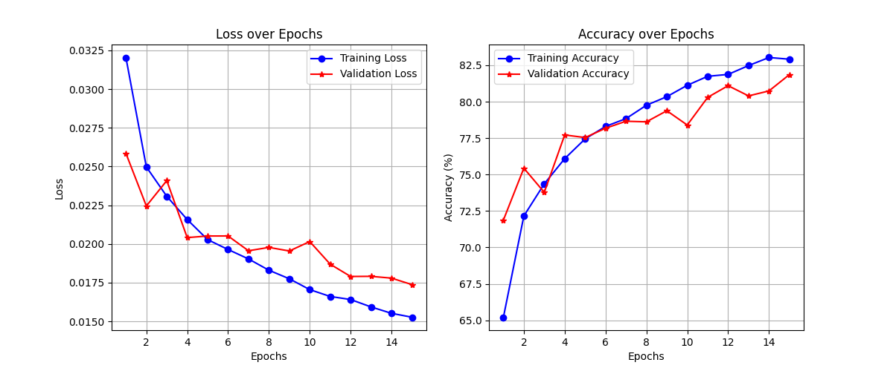

# 🚀 Progressive Self-Training in CNNs: Adaptive Learning for CIFAR-10

## 🏆 Model Performance
We trained a **CNN model** on the full **CIFAR-10 dataset** and achieved:

- **Train Accuracy:** 🎯 **82.71%**
- **Validation Accuracy:** 📊 **81.2%**
- **Test Accuracy:** ✅ **81.46%**

## 📉 Loss & Accuracy Graph
Here is the visualization of the model's loss and accuracy:

---

# 📂 Dataset Information
The dataset consists of **60,000 images**, divided into **20 subsets (D1 to D20)**. Each subset contains **2,500 images**, with every image having dimensions of **32 × 32 × 3** (Height × Width × Channels). The dataset includes a total of **10 classes**.

### 🔹 Training Data
- **D1** contains both **images and labels**.
- **D2 to D20** contain only **images** (**no labels**).

### 🔹 Evaluation Data
- **D1 to D20** contain both **images and labels** for evaluation purposes.